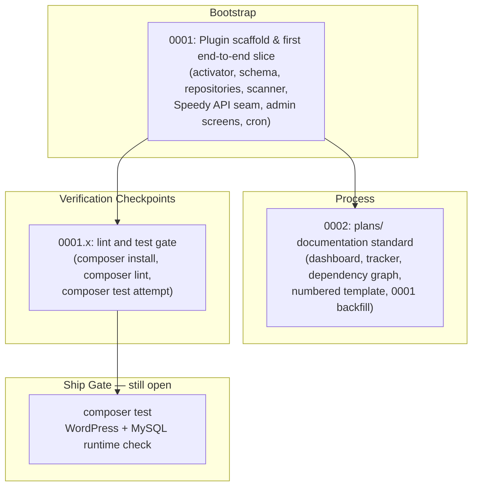

# Speedy Sensor — Implementation Plans

One file per modification. Created **before** the change, updated **again** when it closes.

> **Rule zero:** no edit lands before its plan file exists. If you are about to modify code, write
> `plans/NNNN-short-slug.md` first.

## 📊 Live Progress Dashboard

| Metric | Current Status |
| :--- | :--- |
| **Total Plans** | **5 Plans** |
| **Done** | 4 / 5 (`80%`) |
| **In Progress** | 1 / 5 (`20%`) |
| **Pending** | 0 / 5 (`0%`) |
| **Current Execution Target** | **None** — next target is the ship gate below, which is still closed |
| **Ship Gate** | 🔴 **CLOSED** — `composer lint` now passes with zero violations and PHP 7.4 compatibility is proven, but `composer test` has never run: no `mysqli`, no MySQL server, no `WP_TESTS_DIR` |
| **System Readiness** | Plugin scaffolded end to end behind the Speedy API seam. Unverified against a real WordPress install, a real `dbDelta()` run, or a real cron tick. |

---

## Plan Directory & Dependency Graph



Solid edge = the target plan must be closed before the source counts as complete.
Dashed edge (`-.->`) = soft dependency, the work can proceed without it.

---

## Master Implementation & Progress Tracker

| Plan File | Scope & Title | Priority | Status | Progress | Verification | Notes |
| :--- | :--- | :---: | :---: | :---: | :---: | :--- |
| [**`0001-plugin-scaffold.md`**](./0001-plugin-scaffold.md) | Plugin scaffold and first end-to-end slice | `CRITICAL` | ✅ Done | `100%` | 🟡 Partial | 34 files `php -l` clean, `.pot` regenerated at 147 strings, PSR-4 cross-reference 25/25. Lint since verified green by checkpoint `0001.x`; PHPUnit still never run — ship gate open. No REST layer and no JS shipped, both deliberate deviations. |
| [**`0002-plan-documentation-standard.md`**](./0002-plan-documentation-standard.md) | Standardise the `plans/` documentation format | `MEDIUM` | ✅ Done | `100%` | 🟢 Verified | Documentation only. Dashboard, dependency graph, tracker, legends, numbered template, `0001` backfill, `AGENTS.md` refresh. No PHP touched, so the ship gate is unaffected. |
| [**`0001.x-lint-and-test-gate.md`**](./0001.x-lint-and-test-gate.md) | Lint and test gate checkpoint for `0001` | `CRITICAL` | ✅ Done | `100%` | 🟡 Partial | `composer lint` exits 0, all 305 findings cleared, PHP 7.4 floor proven. `composer test` blocked three ways (no `mysqli`, no MySQL, no test library), so the gate stays open. |
| [**`0003-staging-zip-distribution.md`**](./0003-staging-zip-distribution.md) | Distribute a downloadable staging ZIP via a GitHub Release asset | `HIGH` | ✅ Done | `100%` | 🟡 Partial | ZIP built and structurally verified (44 entries, no dev files); blob hashes prove it came from `dev` not `main`. Release creation blocked: no `gh`, no token. No PHP touched, ship gate unaffected. |
| [**`0004-reduce-database-work.md`**](./0004-reduce-database-work.md) | Remove duplicate `scans` reads, derive latest Web Vitals from the series, and read `information_schema` once per completing scan | `HIGH` | ◍ In Review / Verification | `90%` | 🟡 Partial | Code landed: memo on `ScanRepository`, guarded fallback in `Dashboard`, inventory forwarded to `metrics()`. 15 new tests across 3 files. Found and fixed a stale-memo bug in `delete_by_ids()`. 🗨`composer lint` and `composer test` not run - no PHP on this machine. |

---

## Milestones

- [x] **0001** — Scaffold the plugin: bootstrap, schema + `dbDelta`, repositories, settings layer, scanner, Speedy API seam, admin screens, cron, i18n, lint/test config, `systems/` docs.
- [x] **0002** — Adopt the reference plan structure: dashboard, dependency graph, master tracker, numbered template, `0001` backfill, `AGENTS.md` refresh.
- [x] **0001.x** — Lint and test gate checkpoint for `0001`: install Composer, run `composer lint` (305 findings cleared, exit 0), prove the PHP 7.4 floor. `composer test` blocked and recorded.
- [x] **0003** — Distribute a downloadable staging ZIP: build via `git archive` (honours `export-ignore`), verify structure and blob-hash provenance, publish as a GitHub pre-release asset. Release creation left to the operator: no `gh` and no token in this environment.
- [ ] **Ship gate (still open)** — Install `mysqli` + MySQL/MariaDB and `WP_TESTS_DIR`, then run `composer test`; stand up WordPress, exercise `dbDelta()`, a full cron scan, resume across passes, and one scan against the real Speedy API shape. Carried as `0001.x` § 7.4 follow-ups 1-3.

---

## Naming

`NNNN-short-slug.md` — four digits, incrementing, kebab-case. Never reuse a number.
`NNNN.x-short-slug.md` is reserved for sub-numbered verification checkpoints of a prior plan.

```
0001-plugin-scaffold.md
0002-plan-documentation-standard.md
0002.x-lint-and-test-gate.md
```

## Lifecycle

1. **Before the change** — file created with status `⏳ Proposed`, sections 1–6 written out. Scope
   and approach concrete enough that a different agent could execute them without asking questions.
2. **During** — status moves to `🚧 In Progress`. The approach may be revised; note why in § 7.2.
3. **On completion** — the file is edited again. Status set to `✅ Done`, § 5.3 *Verification Record*
   filled with the commands actually run and their real output, § 7 *Outcome & Deviations* filled
   with what shipped and what deviated.
4. **Closed** — archived or deleted once the change is merged and no longer being revisited, and
   removed from the tracker table above.

A plan file is not finished when the code is written. It is finished when the outcome and the
verification are recorded.

## Status Legend

| Mark | Status | Meaning |
| :---: | :--- | :--- |
| ⏳ | **Proposed** | Written and reviewed, not started. |
| 🚧 | **In Progress** | Edits actively landing. |
| 🔍 | **In Review / Verification** | Code written; lint, tests and manual checks running. |
| ✅ | **Done** | Implemented, verified as far as the environment allowed, outcome recorded. |
| ❌ | **Dropped** | Abandoned or superseded by another plan. Say why in § 7. |

## Verification Legend

| Mark | Meaning |
| :---: | :--- |
| 🟢 | **Verified** — the gate ran and passed. Paste the output. |
| 🟡 | **Partial** — some gates ran, some did not. Name exactly which, under § 5.2. |
| 🔴 | **Failing** — a gate ran and failed. Never mark `Done` in this state. |
| ⚪ | **Not run** — nothing executed yet, or a documentation-only change. |

**The honesty rule:** if a gate did not run, § 5.2 says so in those words. "Tests pass" without the
command and its output is not a verification record. "Not installed on this machine" is a valid
entry; silence is not.

---

## Rules Every Plan Obeys

1. **Plan before code.** The file exists, with sections 1–6 filled, before the first edit of the
   change it describes. A plan written afterwards is a changelog, not a plan.
2. **No claim that was not checked.** Every 🟢 in a Verification Record is traceable to a command
   someone ran. Anything not run is listed as not run, with the reason.
3. **One file per modification.** A plan that needs two unrelated changes is two plans.
4. **Public surface is breaking surface.** If a change touches hook names, option keys, meta keys,
   REST routes or table names, § 1 must state the deprecation path.
5. **Bugs ship with a regression test**, or the plan says in § 7.2 why a test is impossible.
6. **No secrets, no invented facts.** Never write file contents, API signatures, versions or results
   that were not read or observed.
7. **Close the loop.** § 7 is not optional. A plan still showing `⏳ Proposed` after the code landed
   is an unfinished plan.

## Template

Copy this whole block into `plans/NNNN-short-slug.md`. Sections 1–6 are written before the change;
§ 5.3 and § 7 are written after it.

```markdown
# Plan NNNN: Title

> **Status**: ⏳ PROPOSED
> **Priority**: `CRITICAL` | `HIGH` | `MEDIUM` | `LOW`
> **Target Subsystems**: `includes/Scanner/`, `includes/Db/Schema.php`
> **Created**: YYYY-MM-DD
> **Completed**: —
> **Ship Gate**: OPEN or N/A — which gates are green, which are unrun

---

## 1. Problem Statement & Context

What is broken or missing today, and the concrete consequence of leaving it. Cite the real
file, hook or option. Sub-sections `### 1.1` if the problem has separable parts.

## 2. Scope

In:
- ...

Out:
- ...

## 3. Architecture & Design

An ASCII or mermaid diagram plus the decisions taken and why. Record any option considered and
rejected — that is what stops the next agent re-litigating it.

Implementation steps are the `### Step 3.N` sub-sections below. Concrete enough that a different
agent could execute them without asking a question.

### Step 3.1: Short imperative title (`path/to/file.php`)

What changes and why. Include real signatures, SQL or config.

### Step 3.2: …

## 4. Files Touched

- `path/to/file.php` — what changes and why

## 5. Verification Plan

### 5.1 Automated Verification

The exact commands, and what output proves the gate passed.

### 5.2 Manual & Runtime Verification

The steps a human performs, and what they should see.

### 5.3 Verification Record

*(filled at completion)*

Commands run, with their real output. State what was NOT run and why — a missing toolchain, a
missing WordPress install. Consequence of what remains unverified.

## 6. Downstream Dependencies

What this unblocks. What must land first. What this deliberately does not affect.

## 7. Outcome & Deviations

*(written at completion)*

### 7.1 Shipped

What actually landed.

### 7.2 Deviations from the plan

What was dropped, changed or added, and why. Numbered.

### 7.3 Bugs Found and Fixed During Self-Review

Anything the change surfaced in itself.

### 7.4 Follow-ups, in the order they matter

Open items, each concrete enough to become the next plan file.
```

---

## Relationship to `systems/`

`plans/` is per-change and transient — archived once closed. `systems/` is whole-system and
durable — updated on significant shifts only. A plan never duplicates `systems/` prose; it links
to it. When a plan lands a change that shifts the system, `systems/` is edited **in the same
commit**. See `systems/README.md`.
entry; silence is not.
